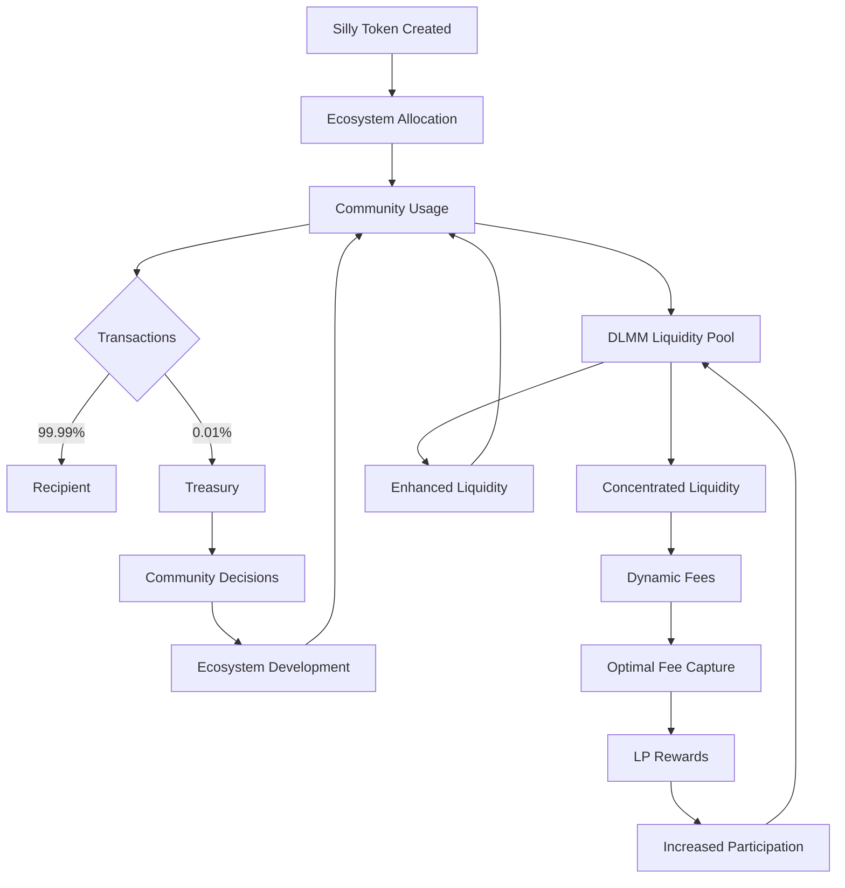

import styles from './VideoSection.module.css';
import { Steps } from 'nextra/components'

## SillyNomics - The Pulse of DAS

Silly is the lifeblood of the DAS ecosystem, empowering you to shape our collective future.

**The Awakening**

  

    
  

  

    

      Feel the pulse of innovation. Silly intertwines through our ecosystem like mycelium, strengthening every connection. With each transaction, each vote, you become part of a living, breathing revolution.
    

  

## Unleash the Power of Silly: Your Fuel for the DAS Movement

By holding Silly, you're grasping the future of decentralised communities. Join us in revolutionising governance, finance, and social interaction. The power to shape tomorrow is in your hands.

<Steps>
### Wield Your Power
- Go Silly to not feel silly again!
- Hold, Stake, Celebrate!
- Stabilise & earn Liquidity fees

### Contribute to the Ecosystem
- Every transaction automatically contributes 0.1% to the community treasury
- This micro-contribution fuels ecosystem growth and funds innovative projects
- Your daily activities directly support the DAS vision
### Exercise Your Voice
- Use your tokens to vote on crucial decisions across all DAS initiatives
- Shape the future of SynCity, DAS Brennt, and future Syndicates
- Propose new ideas and projects for community consideration
### Enjoy Seamless Transactions
- Experience fast, censorship-resistant exchanges across the DAS ecosystem
- Benefit from Solana's cutting-edge technology for efficient and eco-friendly transactions
- Participate in a new standard for digital currencies
### Access Exclusive Experiences
- Unlock premium events and services in SynCity
- Gain priority access to the annual DAS Brennt festival
- Immerse yourself in a world of innovation and creativity
### Provide Liquidity and Earn
- Contribute to ecosystem stability by providing liquidity on Meteora DLMM
- Earn rewards for your participation
- Strengthen the DAS financial infrastructure while benefiting personally
### Embrace the Silly Economy
- From year two, Silly becomes the exclusive medium of exchange across all Syndicates
- Experience unparalleled operational efficiency and seamless integration
- Drive continuous innovation through community-focused development
### Grow with the DAS Ecosystem
- Benefit from increasing token scarcity as the ecosystem expands
- Thrive in the economies of various Syndicates
- Actively participate in driving ecosystem innovation and growth
</Steps>

## SillyCation – A Blueprint for Harmony

The allocation of Silly is thoughtfully designed to foster the growth and resilience of the DAS ecosystem.

  
**Allocation & Vesting Overview**

| Allocation Category | Distribution Details | Allocation Percentage | SPL-Tokens | Vesting Period |
| --- | --- | --- | --- | --- |
| Founder Allocation | 2% to Funder Wallet & 2% to Partners in Multi-Sign Wallets | 4% | 737,869,762.92 | 18 months with a 4-month cliff, then quarterly |
| Private Sale (INO) | Early Angel Wallets | 8% | 1,475,739,525.84 | 12 months with a 3-month cliff, then quarterly |
| Public Sale (INO) | 25% each to SynCity, Optik, SynSea, Millynair (10% INO + 15% post-INO) | 14% | 2,582,584,170.22 | Immediate for INO, 12 months for post-INO rewards |
| Public Sale (IDO) | Direct to Users' Wallets | 66% | 12,174,851,088.18 | Immediate access |
| Reserve | Founder Multi-Signature Wallets for Strategic Reserves | 8% | 1,475,739,525.84 | 12 months, quarterly releases post 3-month cliff |

A phased approach from INO to IDO ensures empowerment and flexibility for early participants, promising a sustainable journey towards success.

## SillyBution

With the strategic post INO/IDO-distribution, Silly becomes the cornerstone of transactions across all DAS Syndicate's, ensuring a cohesive and vibrant ecosystem from the second year onwards. The detailed distribution and operational specifics are comprehensively documented in the relevant DASnomics papers.

## Roadmap to Silly Dominance

| Phase | Milestone | Description | Success Criteria |
| ----- | --------- | ----------- | ---------------- |
| 1 | Genesis (2024 Q3) | Silly Token launch on Solana | Smart contract audited, community approved |
| 2 | Community Embrace (2024 Q4) | INO/IDO launch | 30% token sale, active engagement |
| 3 | Ecosystem Integration (2025 Q1) | Silly powers all Sindicates | Successful cross-DAS transactions |
| 4 | Economic Evolution (2025 Q2) | Implement halving and DePIN | Halving executed, DePIN operational |
| 5 | SynCity Synergy (2025 Q3) | Enhance SynCity utility | High token usage in SynCity |
| 6 | AI Governance (2025 Q4) | SputnikGPT integration | AI-assisted proposal system live |
| 7 | Full Activation (2026 Q1) | SynCity launch, inaugural DAS Brennt | Peak transaction volume, positive feedback |
| 8 | Global Resonance (2026 Q2) | Assess global impact | Sustainability goals met, expanding influence |

Be part of the Silly revolution. Don't just witness the future—create it.

**The future is Silly. Are you?** [Join the IDO Now](https://www.dexlab.space/mintinglab/spl-token/B2Qfkrw8SNr7dBaxBr62zTQmF74f6aUFw8cdibvB3L5k1)