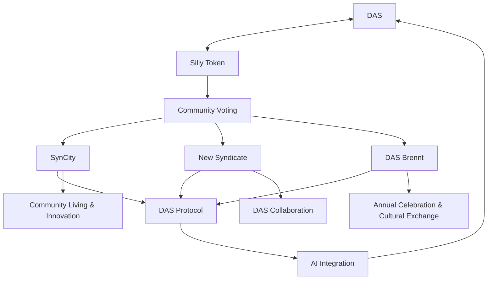

import Image from 'next/image'
import styles from './VideoSection.module.css'
import { useState, useEffect } from 'react'
import { Steps } from 'nextra/components'
import { DisconnectButton } from '../components/DisconnectButton'

## Unleash Your Potential with DAS

Welcome to the Decentralised Autonomous Syndicate (DAS) - where innovation meets freedom, and your voice shapes the future.

**The Awakening**

  

    
  

  

    

      Discover a world beyond conformity. DAS opens the door to a realm of unlimited potential and collective dreams. Here, your ideas flourish, your voice matters, and together, we craft a revolutionary future.
    

  

### Our Essence

DAS is more than an ecosystem; it's a movement. We're building Syndicates like SynCity, a decentralised secret garden in Ibiza, where trailblazers like you redefine the future of community, living and, working. Our mission? To break free from centralised constraints and unleash unbridled creativity.

### DAS Advantage

- **True Democracy**: Your voice shapes our collective destiny
- **Sustainable Living**: Harmonise with nature through cutting-edge technology
- **Global Innovation Network**: Connect with brilliant minds worldwide
- **Cultural Renaissance**: Celebrate creativity at our annual DAS Brennt Festival
- **Purpose-Driven Existence**: Find your role in our thriving ecosystem

### Our Powerhouse

- [**Silly (DAS) Token**](http://das.wtf/silly): Fuels your governance and access unparalleled resources
- [**SynCity**](http://das.wtf/SynCity): Your playground for visionary living & working
- [**DAS Brennt Festival**](http://das.wtf/DASBrennt): Ignite your passion annually
- [**Sputnik LLM**](http://das.wtf/Sputnik): Amplify our collective intelligence

## Your DAS Journey

<Steps>
### Embrace Your Destiny
- [Secure your DAS Passport](https://eu.jotform.com/form/232253084368053#preview)
- [Invest in tomorrow with Silly](https://www.dexlab.space/mintinglab/spl-token/B2Qfkrw8SNr7dBaxBr62zTQmF74f6aUFw8cdibvB3L5k1)
- [Mint your Visa to SynCity](https://das.wtf/syncity)

### Transform Our World
- Propose groundbreaking ideas
- Vote on pivotal decisions
- Collaborate on visionary projects

### Experience the Extraordinary
- Live in our utopian SynCity
- Celebrate at DAS Brennt
- Pioneer AI with Sputnik

### Catalyse Global Change
- Expand our visionary network
- Evolve the DAS Protocol
- Redefine community structures 
</Steps>

## Roadmap to Revolution

| Phase | Milestone | Description | Success Criteria |
| ----- | --------- | ----------- | ---------------- |
| 1 | Foundation (2024 Q3) | Establish DAS governance | Framework approved |
| 2 | Community Growth (2024 Q4) | Launch INO/IDO | 30% token sale, active engagement |
| 3 | Physical Development (2025 Q1) | Secure SynCity land | Acquisition complete, plans approved |
| 4 | Ecosystem Expansion (2025 Q2) | Implement DePIN & DAO tools | Systems operational |
| 5 | SynCity Beta (2025 Q3) | Soft launch | Core infrastructure live, positive feedback |
| 6 | AI Integration (2025 Q4) | Deploy SputnikGPT | AI systems integrated |
| 7 | Full Launch (2026 Q1) | Open SynCity, inaugural DAS Brennt | High occupancy, successful festival |
| 8 | Global Impact (2026 Q2) | Expand DAS influence | Partnerships established, targets met |

  
Unlock Your Potential with DAS

  - Find your visionary tribe
  - Secure a resilient future
  - Amplify your influence
  - Access cutting-edge tools
  - Forge global connections
  - Embrace sustainable living
  - Achieve financial autonomy
  - Nurture holistic well-being
  - Leave a lasting legacy
  - Experience futuristic living
  - Celebrate human ingenuity
  - Shape ethical AI
  - Reclaim your digital sovereignty

**Be the architect of tomorrow. Join DAS today.**

[Become a Citizen](https://eu.jotform.com/form/232253084368053#preview) | [Mint your Visa](https://mint.das.wtf)
