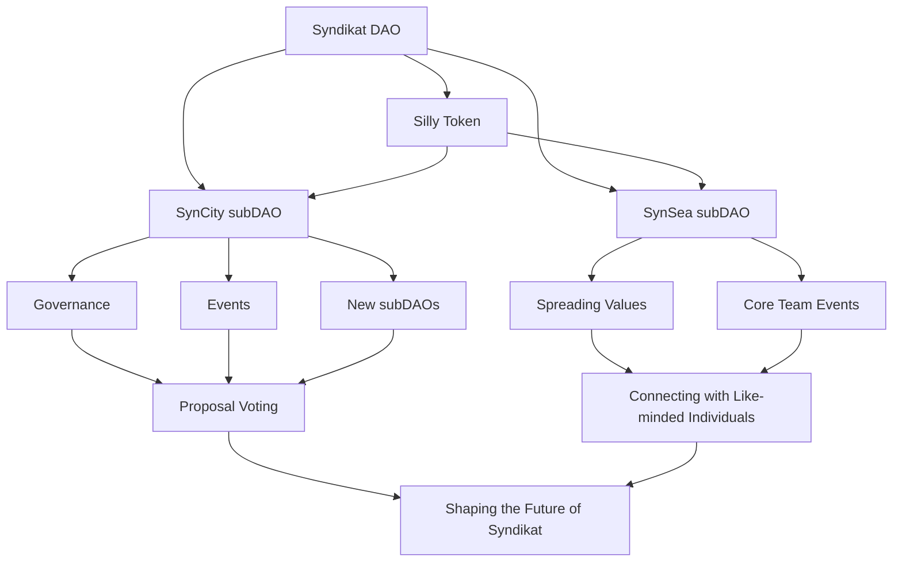

import Image from 'next/image'
import styles from './VideoSection.module.css';
import { useState, useEffect } from 'react';
import { Steps } from 'nextra/components'

## Syndikat: Decentralised power, pure innovation!

  

    <video src="/yaqwer.mp4" autoPlay muted loop width="100%" height="auto" />
    

    [©](https://www.thevisualdome.com/)
    

  

  

    {typeof window !== 'undefined' ? (
      

Ignite the Pioneer, Unleash the Rebel, Embrace the Artist.     

    ) : (
      

Ignite the Pioneer, Unleash the Rebel, Embrace the Artist.     

    )}
  

{typeof window !== 'undefined' ? (
  

Our Silly (Milly) Token stands at the core of our strategy, bridging our diverse initiatives, thereby amplifying the utility of both the token and the subDAOs. Our mission is to forge alliances that echo our revolutionary spirit, thus expanding our influence and reaffirming our commitment to a decentralised future.  

) : (
  

Our Silly (Milly) Token stands at the core of our strategy, bridging our diverse initiatives, thereby amplifying the utility of both the token and the subDAOs. Our mission is to forge alliances that echo our revolutionary spirit, thus expanding our influence and reaffirming our commitment to a decentralised future.  

)}

## SubDAOs The Pillars of Syndikat

**[SynCity DAO:](https://syndikat.wtf/syncity)**: The creative powerhouse of Syndikat, fusing digital prowess with genuine human connections, nurturing projects where technology serves as a catalyst for artistic and social ventures.

**[SynSea DAO:](https://syndikat.wtf/synsea)** A sailing yacht designed to connect all continents with the values of Syndikat. It's the safe haven for our media elite and prophets to spread a transparent system of love and equality.

**[SputnikLLM](https://gpt.syndikat.wtf)** As we cherish efficiency and innovation, last but not least, our GPT assistant helps the Syndikat community to utilise resources efficiently and focus on what truly matters, instead of squandering time on repetitive tasks. With a curated list of assistants, we aim to enhance navigation through Syndikat with:
    
   - **SillyGPT**, elevate the quality of legal and accounting with - **LibertyGPT**, and always provide the best deal or product with 
   - **DealGPT**.
    Mental health is crucial for a strong community, and for psychological consultation, 
    - **MindGPT** will be by your side day and night. The cherry on top is 
    - **CloneGPT**; feeling lonely or missing a loved one? Ignite your memories by cloning the visual appearance, voice, and knowledge of a person who will never leave you and communicates as an HD live avatar whenever you desire!
    

  ## Silly: The Embodiment of Our Ethos
  
  At the core of Syndikat lies Silly, a manifestation of our unwavering commitment to creativity, innovation, and the pursuit of the extraordinary. Silly represents the spirit of our community, guiding us through the uncharted territories of the digital realm. The following chapters unfold the captivating tale of Silly's journey, as seen through her eyes, offering a glimpse into the heart and soul of Syndikat DAO.

  
Explore the full journey

### I. Silly's Odyssey to Syndikat DAO

  

    <video src="/ofta.mp4" autoPlay muted loop width="100%" height="auto" />
    

      [©](https://www.thevisualdome.com/)
    

  

  

    {typeof window !== 'undefined' ? (
      

        In a world cloaked in monochrome, where the ordinary casts long shadows, there emerges Syndikat DAO—a luminous fount of rebellion nestled away in the unseen. It stands not merely as a gathering but as a symphony of change, a covert oasis where bravery and ingenuity intertwine, charting paths into the uncharted.
      

    ) : (
      

        In a world cloaked in monochrome, where the ordinary casts long shadows, there emerges Syndikat DAO—a luminous fount of rebellion nestled away in the unseen. It stands not merely as a gathering but as a symphony of change, a covert oasis where bravery and ingenuity intertwine, charting paths into the uncharted.
      

    )}
  

### II. Awakening in the Hues of Grey

  

    <video src="/mundane.mp4" autoPlay muted loop width="100%" height="auto" />
    

      [©](https://www.thevisualdome.com/)
    

  

  

    {typeof window !== 'undefined' ? (
      

Trapped beneath a canopy of sameness, Silly's essence simmered with a thirst for escape. Bound by the chains of conformity, her soul was a tempest of longing. In her deepest trough of despair, a light from Syndikat DAO cut through the murk, a beacon steering her to a destiny of her own weaving. It was a fortuitous brush with an arcane mushroom that flung open the gates to this secluded haven, melting away the fetters of delusion, summoning her to step forth.
      

    ) : (
      

Trapped beneath a canopy of sameness, Silly's essence simmered with a thirst for escape. Bound by the chains of conformity, her soul was a tempest of longing. In her deepest trough of despair, a light from Syndikat DAO cut through the murk, a beacon steering her to a destiny of her own weaving. It was a fortuitous brush with an arcane mushroom that flung open the gates to this secluded haven, melting away the fetters of delusion, summoning her to step forth.
      

    )}
  

### III. The Enigmatic Summoning

  

    <video src="/fly.mp4" autoPlay muted loop width="100%" height="auto" />
    

      [©](https://www.thevisualdome.com/)
    

  

  

    {typeof window !== 'undefined' ? (
      

As Silly's transformation unfurled, the soft rapping of a 'knock, knock' resonated within, stirring the depths of her being. "Who's there?" she mused. "Destiny," the cosmos murmured back, entrusting her with the Knock-Knock Passport. This insignia, a symbol of her rebirth, spread a vista of boundless creativity and liberty before her, inviting her to traverse its expanse.
      

    ) : (
      

As Silly's transformation unfurled, the soft rapping of a 'knock, knock' resonated within, stirring the depths of her being. "Who's there?" she mused. "Destiny," the cosmos murmured back, entrusting her with the Knock-Knock Passport. This insignia, a symbol of her rebirth, spread a vista of boundless creativity and liberty before her, inviting her to traverse its expanse.
      

    )}
  

## The Governance Ethos of Syndikat

champions governance that is transparent, inclusive, and participatory, powered by the Silly (Milly) Token. This framework ensures every member's voice is heard, shaping the trajectory of the DAO and its initiatives.

## **Roadmap to Revolution**

| Quarter | Milestones |
| --- | --- |
| 2024 Q2 | Establishing the Syndikat DAO and setting up governance structures. |
| 2024 rvQ3 | Initiating the development of SynCity, aiming to create a hub for collaboration across all aspects of modern life. |
| 2024 Q4 | Implementing DAO features and rigorously reviewing SynCity's development to ensure it aligns with Syndikat's holistic vision. |
| 2025 Q1 | Launching operations and officially opening SynCity to members, inviting them to explore and contribute to this new ecosystem. |

We're not merely crafting a platform; we are igniting a movement in every aspect of digital and societal evolution. This call is for the dauntless, those in harmony with the cadence of defiance. In Syndikat, we don't just gather forces; we unite disruptors and visionaries ready to embark on this epoch-making journey.

<Steps>
### Step 1
[Get your Knock, Knock Passport](https://eu.jotform.com/build/232253084368053) 
### Step 2
[Mint your Visa](http://localhost:3000/syncity)
### Step 3
[Explore SynCity](http://localhost:3000/syncity)
</Steps>

