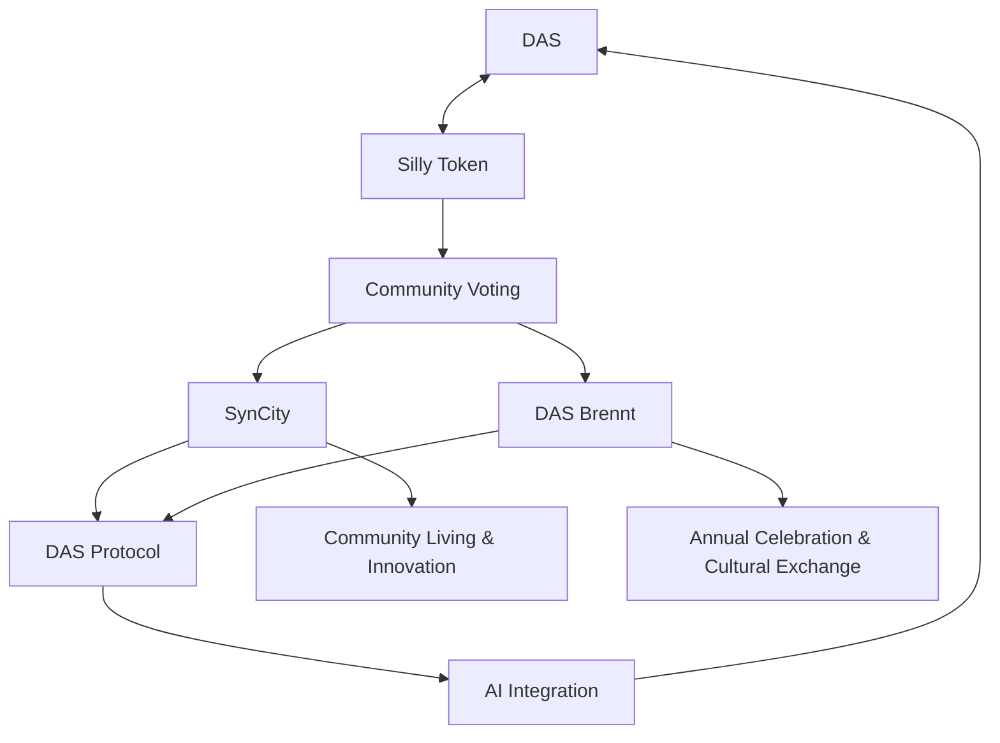

import Image from 'next/image'
import styles from './VideoSection.module.css';
import { useState, useEffect } from 'react';
import { Steps } from 'nextra/components'
import { DisconnectButton } from '../components/DisconnectButton'

## Decentralised Power, Pure Innovation!

Silly embodies the spirit of DAS, representing our commitment to creativity, innovation, and the extraordinary. Her story reflects our community's journey.

**I. The Awakening**

  

    

      <iframe
        src="https://giphy.com/embed/l0MYN9SzgA1FGhVN6"  
        width="100%"
        height="100%"
        style={{ position: 'absolute' }}
        frameBorder="0"
        className="giphy-embed"
        allowFullScreen
      ></iframe>
    

    

      
    

    

  

  

    {typeof window !== 'undefined' ? (
      

        In a world of stifling conformity, Silly discovered a luminous mushroom whispering,
        "Knock, knock." Its spores danced, forming a mystical key. As she turned it, reality
        shimmered. Silly stepped through, her third eye bursting open to reveal the vibrant,
        interconnected realm of DAS—a universe of unlimited potential and collective dreams.
      

    ) : (
      

        In a world of stifling conformity, Silly discovered a luminous mushroom whispering,
        "Knock, knock." Its spores danced, forming a mystical key. As she turned it, reality
        shimmered. Silly stepped through, her third eye bursting open to reveal the vibrant,
        interconnected realm of DAS—a universe of unlimited potential and collective dreams.
      

    )}
  

DAS (Decentralised Autonomous Syndicate) is a groundbreaking ecosystem empowering free thinkers in the Web3 era to reimagine community living and working. 

### **Our Mission**
To unite visionary pioneers in building SynCity, our decentralised secret garden in Ibiza, as the foundation for future subDAOs. We're breaking free from centralised constraints to foster open-source collaboration and unbridled creativity.
### **Our Vision** 
A world where decentralised communities drive progress, every voice matters, and technology amplifies human potential. DAS stands as the blueprint for a global network of innovative, self-governing physical ecosystems.
### **The Solution**
**DAS** is commited to SynTech Democracy: a decentralised, transparent, and inclusive governance model that empowers everyone to shape the future of the ecosystem.

- **Decentralised Governance:** Every citizen shapes DAS future by Creating a space where power is distributed equitably, fostering autonomy and innovation.
- **Transparency:** Building trust through open governance and clear communication.
- **Sustainable Living:** Promoting eco-friendly practices and supporting initiatives that prioritise mental health and well-being. DePIN ensures efficient resource distribution.
- **Global Connection:** DAS links SynCity to a worldwide network of innovators.
- **Cultural Flourishing:** Annual DAS Burne Festival celebrates our collective creativity.
- **Purpose-Driven Roles:** Citizens are encouraged to find roles that align with their abilities, passions and societal needs, fostering fulfillment and productivity.

### **Our Ecosystem**

- [**Silly (DAS) Token**](http://das.wtf/silly) Our utility token fuelling governance and access to resources
- [**Syncity**](http://das.wtf/SynCity) our secret garden in Ibiza — a playground for visionaries that we're building from scratch as a community. This vibrant space embodies our commitment to decentralised living, innovation, and harmony with nature
- [**DAS Burne Festival**](http://das.wtf/DASBrennt) Annual 13-day celebration of creativity and innovation
- [**Sputnik LLM**](http://das.wtf/Sputnik) Our AI integration enhancing collective intelligence

## **How It Works?**
**DAS** thrives as a living ecosystem, mirroring nature's interconnected networks. Here, innovation and growth flourish organically within our micro-communities. Fostering an environment where diverse talents thrive together.
<Steps>
### Embark on Your DAS Adventure
- **Answer your Destiny** call to join our visionary community 
- [**Secure your exclusive DAS Passport**](https://eu.jotform.com/form/232253084368053#preview), your key to our ecosystem 
- [**Invest in your future**](https://www.dexlab.space/mintinglab/spl-token/B2Qfkrw8SNr7dBaxBr62zTQmF74f6aUFw8cdibvB3L5k1) Participate in the Silly (DAS) token presale 
- [**Mint your Visa**](https://das.wtf/syncity), your ticket to unprecedented opportunities 
- [**Co-create our shared future**](https://realms.today/), harnessing the power of collective intelligence
### Immerse Yourself in the DAS Community
- **Spark change** Propose groundbreaking ideas to revolutionize our ecosystem 
- **Wield your influence** Vote on community decisions using Silly tokens & NFT Visa 
- **Forge alliances** Collaborate on transformative projects with fellow visionaries 
- **Architect our world** Shape the development of SynCity & new DAS initiatives
- **Lead the charge** Actively participate in governance, defining DAS's trajectory
### Explore the DAS Universe
- **Discover SynCity** Experience our community-crafted living and working utopia 
- **Ignite your passion** at the annual DAS Brennt Festival, a celebration of creativity 
- **Embrace the future** with Sputnik, our cutting-edge AI integration project
### Fuel Our Collective Growth
- **Expand our horizons** Invite like-minded innovators to join the DAS revolution 
- **Pioneer new frontiers** Engage in partnerships and subDAS initiatives 
- **Shape our foundation** Contribute to the evolution of the DAS Protocol 
- **Redefine living** Help craft the future of decentralized, community-centric existence
</Steps>

## **Roadmap to Revolution**

| Phase | Milestone | Description | Success Criteria |
| ----- | --------- | ----------- | ---------------- |
| 1 | Foundation (2024 Q3) | Establish DAS and set up governance structures | Governance framework documented and approved |
| 2 | Community Growth (2024 Q4) | Launch INO/IDO and onboard initial community | 30% token sale target reached, active community engagement |
| 3 | Physical Development (2025 Q1) | Secure land and initiate SynCity development | Land acquisition completed, development plans approved |
| 4 | Ecosystem Expansion (2025 Q2) | Implement DePIN features and DAO tools | Functional DePIN systems, DAO governance operational |
| 5 | SynCity Beta (2025 Q3) | Soft launch SynCity and test key systems | Core infrastructure operational, initial resident feedback positive |
| 6 | AI Integration (2025 Q4) | Deploy SputnikGPT and enhance DAS Protocol | AI systems integrated, protocol documentation finalized |
| 7 | Full Launch (2026 Q1) | Open SynCity and host inaugural DAS Brennt Festival | High citizen occupancy, successful festival execution |
| 8 | Global Impact (2026 Q2) | Expand DAS influence and assess initial outcomes | Partnerships established, sustainability targets met |

  
DAS Benefits

  
    - **Belong to a Visionary Community**: Find your tribe among forward-thinking innovators and changemakers
    - **Secure Your Future**: Contribute to building a resilient, decentralised ecosystem that safeguards your interests
    - **Amplify Your Voice**: Experience true democracy where your ideas shape the collective future
    - **Unleash Your Potential**: Access cutting-edge tools and knowledge to elevate your skills and creativity
    - **Forge Meaningful Connections**: Build lasting relationships with like-minded individuals from across the globe
    - **Live Sustainably**: Embrace an eco-friendly lifestyle in harmony with nature and technology
    - **Achieve Financial Freedom**: Benefit from innovative economic models and early investment opportunities
    - **Nurture Your Well-being**: Explore holistic approaches to mental and physical health in a supportive community
    - **Leave a Lasting Legacy**: Co-create solutions that positively impact generations to come
    - **Experience Cutting-edge Living**: Reside in SynCity, a smart urban environment at the forefront of innovation
    - **Celebrate Creativity**: Immerse yourself in the annual DAS Brennt festival, a testament to human ingenuity
    - **Shape the Future of AI**: Engage with and influence the development of ethical, decentralised AI systems
    - **Reclaim Your Autonomy**: Break free from centralised systems and take control of your digital identity and data
 

**Co-create** the future with DAS!

[Become Citizen](https://eu.jotform.com/form/232253084368053#preview) | [Mint your Visa](https://mint.das.wtf)
